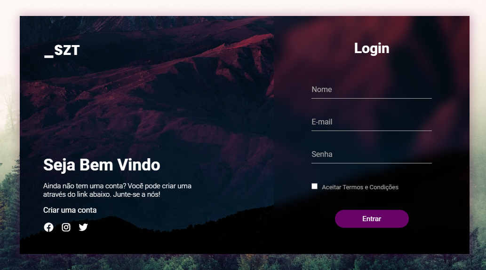

# Login

    
    

 

Esta interface foi desenvolvida com simplicidade e usabilidade, permitindo que o usuário faça login sem muitas complicações. 

A página contém os seguintes campos:

 - Nome
 - E-mail
 - Senha

 Além disso, um botão Entrar para completar o processo de login.

 

